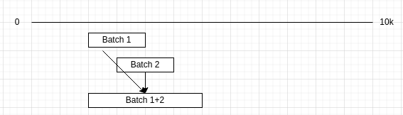

# Randomizing NFTs

Randomizing NFTs is a pretty common practice. All NFTs in a collection have different rarities, which determine their value, so after a collection has been fully minted their pictures will be revealed and randomly distributed among the NFTs.

It is important that this process is kept fair and can't be influenced by NFT creators, since otherwise they could manipulate the raffle to give themselves the most rare NFTs.

In this post I'll go over the multiple strategies that NFTs have used to solve this, discuss downsides and propose a new standard. We'll assume 10k collection size for all examples.

## Offset by a random number
This is the most common method, after the collection has been fully minted you generate a random number from 0 to 10k and add it to the number of each NFT.
```
normalizedRandom = random % 10e4
newNumber = (mintNumber + normalizedRandom) % 10e4
```

So if an NFT has been the 2300th to be minted and the random number is 5000, it's new id will be 7300.

This is really elegant: it's extremely simple and unlikely to have bugs, fully random and it costs almost no gas.

However, using this requires that the collection be revealed all in one go. Thus, if you have a collection that has only been partially minted you are left with only 2 choices:
- Reveal collection: This announces the order in which future rare NFTs will come out, allowing savvy users to selectively mint the rarest ones, exploiting the collection.
- Don't reveal collection until it's fully minted, leaving users with template NFTs. This sucks and kills hype.

Instead, a better solution would be to progressively reveal NFTs as they get minted.

## Meebits
Meebits set out to solve that by running the Fisher–Yates algorithm, an optimal algorithm for shuffling a list of items, directly inside their smart contract. They did so by shuffling one item every time someone minted an NFT, so users were able to see their NFTs right after they minted them.

The way they did it was by creating some pseudorandomness from parameters such as the block hash and timestamp and shuffling 1 item at a time based on them.

This had many issues:
- It heavily increased gas costs, according to my back of the envelope calculations the increase was 3x.
- Blockchain parameters can be manipulated by miners, so randomness could be manipulated
- It was possible to use the atomicity of txs to mint an NFT and revert the tx if you got an NFT you didn't want, virtually giving you infinite tries at the game.

Eventually the 3rd issue was exploited and one party managed to mint the most rare NFTs to themselves. There are some ways to solve this, such as preventing mints from contracts or revealing in the next block, but they can all be manipulated with miner collusion, instead the real solution lies in using better randomness generators.

## Improving randomness
Every time on-chain randomness comes up someone will mention chainlink's VRF, so we'll use that as our source of randomness. Getting a random number through VRF costs about ~30\$, so we can abandon the idea of getting one for each NFT, as that would cost 300k\$. Instead, we'll do reveals in batches, so after each batch of 1k NFTs have been minted we'll reveal them.

One way to achieve that is by running the Fisher-Yates algorithm within a view method such as tokenURI(). As that is only called by external scripts it incurs no gas costs, so we can add as much logic to it as we want. However, even when running view methods there's an upper gas bound, and this bound depends on the node you are calling.

Fisher-Yates performs O(n) operations, where n is the length of the list to shuffle, meaning that we'd be doing 10k operations within our code. This is large enough to go over the gas limit, so we might end up in a situation where if someone uses etherscan, which uses a gas limit ~3x higher than the default, they'll successfully run the method, but if a wallet uses a node that has a lower limit, the method won't run and the NFT won't be displayed.

This means taking a gamble as your NFT might break in some cases, so it's better to just avoid it. We could solve this by running the algorithm on-chain and storing the outputs, but that becomes prohibitively expensive in terms of gas.

Thus, we need a more gas efficient solution.

## Offchain
The easiest solution is to just run the shuffling off-chain, using VRF numbers from the contract. All the inputs to the contract are known and can't be tampered with, so anyone can run the same code and verify that the results are correct.

However we opted not to go that route because:
- It still requires requires trust in the devs
- It's harder to verify compared to on-chain
- We want to build a standard that other collections can use, and that involves making it easier to use

For these reasons we chose to have all logic directly in the contract.

## On-chain batch reveals
The fundamental idea is to extend the first strategy discussed (offset by random) to get it to work on batches. So we'll take the first batch of 1k NFTs and offset them by a random number, take the second batch and do the same, and so on.

A basic implementation involves picking a random offset from 0 to 10k for each batch, reserving the number at the offset for the batch, and, if there's collision between batch reservations, merge them into one large reservation.



However this implementation doesn't distribute batches fully randomly. Just think that, after the first batch has been allocated only 9k places are available, but we are picking a number up to 10k, so we are folding 10k positions over 9k spots, which leads to a probability distribution that favors some numbers over others.

To avoid this, we'll pick a number in $[0, 10^4-10^3batch)$, and then we'll traverse a distance equal to that number, jumping over the spaces that have already been allocated. This is equivalent probabilistically to renumbering open slots from $[0, 10^4-10^3batch)$ and performing offset by random number. Thus, within a batch, properties of offset by a random number are maintained (fully random).

This mechanism has an asymptotic cost of $O(n^2)$ where $n$ is the number of batches that there are. Thus with 10 batches that number is 100, much lower than the 10k we were discussing earlier.

## Biased randomness from VRF
https://twitter.com/0xngmi/status/1493849106355269634

## Information leak from using this mechanism
Compared to an algorithm such as Fisher–Yates, both our algorithm and the simple offset by random leak certain information by making the relative ordering known in advance.

Imagine that in the last batch there are 8 NFTs left and the distribution is like this:
CCCCRRRR where C=common and R=rare
and then you mint the 4th and 8th (00010001). Then you are guaranteed to get a rare NFT.

If you minted 2 random ones on average you'd also have gotten 1 rare NFT, but could also have gotten 0 or 2, instead this minting mask exploits the inner order of the batch to ensure that you always get 1 rare (so less variance)

This also applies to the NFT contracts that just do randomness by applying an offset, but it's easier to exploit if this algorithm is used because instead of there being 10k positions during the last batch there will only be 1k positions.

Antebear also came up with a proof that Expected amount of rare NFTs stay constant with all minting orders, only thing that changes is variance:

here issa proof bera tinks

(assumin 10k cats an 10 batches, so 1k startin spots possibl) 

let dat mask hav "n>0" non-0 spots. let da each remainin cats hav v_i value v_0 to v_999, wher sum o v_0 to v_999 = V, an v_a=V/1000.

den dat implies dat if u had 1k parallel universes and did exaccly da mints across each o da 1k possibl startin spots, da sum o all total value 4 dis mask across 1000 parallel universes, divided by 1000, wud hav 2 b higher den n * v_a

so wat is da "total" valu across dese 1000 parallel universes? Issa exactly n * V, since 4 erre "spot" da mask issa 1 (mint), over da 1000 universes dat means ERRE cat issa minted, so if der r "n" spots, den da TOTAL valu across da 1000 universes = n * V, so da avg value = n * V /1000 = n * v_a

note dat n*v_a is exaccly da EV o da naive case (no mask)

howevah note dat da "worst case cost o GUARANTEEIN A RARE" wit a mask atacc is <<<<<< "worst case cost o GUARANTEEIN a rare" in da truly random case
(if u let R = numba o rares, den da "worst case cost o guaranteein a rare" wit mask attacc = n x MINT_COST whereas in da non-mask-attacc case issa (1000-R+1) x MINT_COST) 

Credit: antebear

## Contribute
Tubby cats is launching in a few days, if you'd like to contribute I'd really appreciate a review of [our contract](https://github.com/0xngmi/tubbies/blob/master/contracts/Tubbies.sol#L172)!